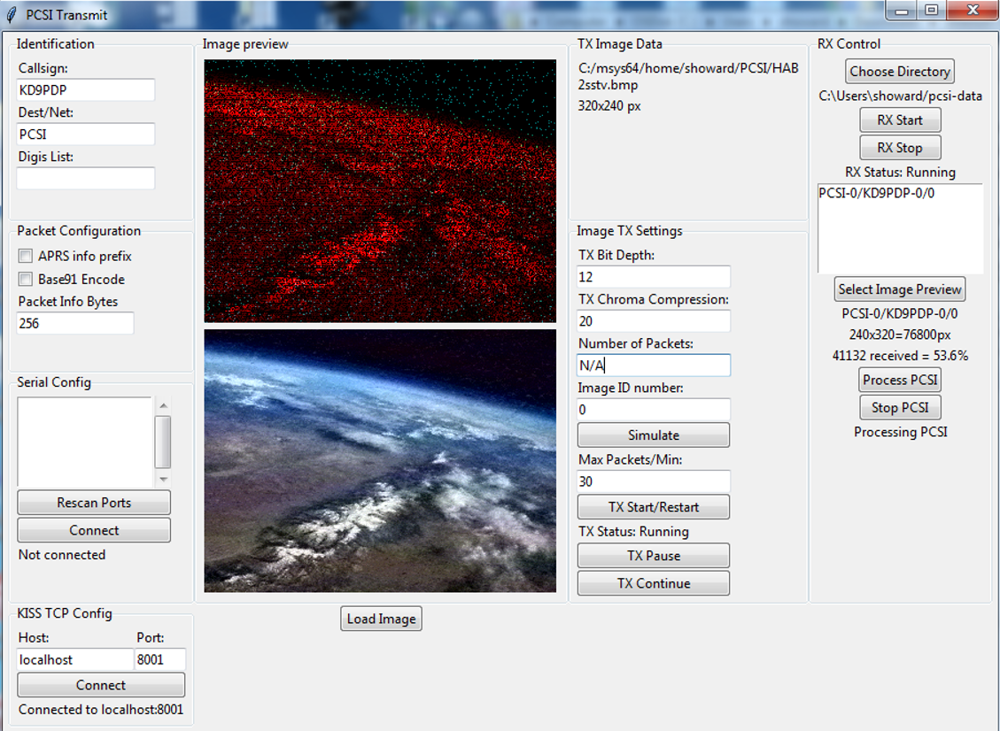
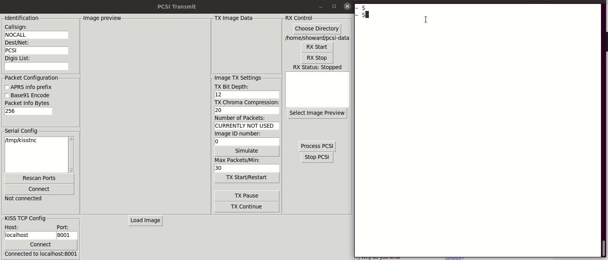
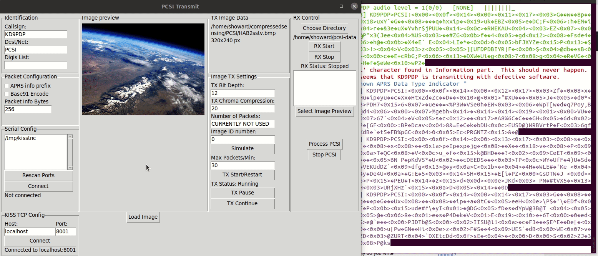

# Packet Compressed Sensing Imaging (PCSI)
This project contains the sample program for how to use Packet Compressed Sensing Imaging (PCSI) to transmit images over unconnected, noisy, lossy channels.

Packet Compressed Sensing Imaging (PCSI) is a way to:
* Send images over unconnected networks such as AX.25 in amateur radio or UDP
* Each individual packet contains information about the entire image! That means that you start reconstructing the whole image after 1 packet. Each additional packet just improves image quality.
* Packet loss does not really matter! Packet loss just decreases overall image quality, it does not cause parts of the image to be "blank" as in SSTV or SSDV.
* Extremely low-computational power needed at transmitter! No FEC needed, no encoding/decoding jpeg, no compression - so a simple 8-bit microcontroller can easily transmit packets
* If you "miss" the beginning, middle, or end of a transmission, you can still see the whole image with high quality! Broadcast your images to be received by many people at once, each will reconstruct the image even if each receives different numbers and sequences of packets!
* You can transmit sequence of images (movies), real-time emergency imaging data over noisy channels, or send imaging data from high altitude balloons with minimal computing power to be received by anyone interested in listening.

The reference software included here allows you to:
* Send and receive images using PCSI on Windows, Mac, and Linux. Pre-compiled binaries are available for Windows and Linux. Macs are doable too, I just don't have one to pre-compile binaries.
* Connect to hardware TNCs using KISS serial or KISS TCP connections
* Connect to sound card modems such as fldigi or direworlf to use any of those modes and hardware!
* Therefore it's compatible with HF modes using fldigi or anything that accepts KISS connections
* The software transmits packets compatible with the APRS network, so it is possible to relay images using the APRS network. (Use this with caution as APRS networks may not have the spare capacity in all regions, and images that are not timely or tactical may not be well suited for APRS.)

Also included is the specification for the [pseudorandom data packet (PDP) protocol](./spec.md) that enables PCSI.

Development information is available on [the project Github page](https://github.com/maqifrnswa/PCSI)

Author: KD9PDP

License: GPL-3.0

## What is PCSI?
PCSI is a way of transmitting imaging data over unconnected networks where receiving stations may each receive different random packets (due to corruption from noise or blocked signals) yet each receiving station can individually reconstruct the entire original image with high fidelity only with the packets it received. High quality, full frame images, can be reconstructed with as little as 10% of the original data being transmitted or received. Even if a receiver joins the broadcast mid-transmission, it will be able to reconstruct the full image. For more details, click [here](./details.html).

## How to install?
Download from the [github releases page](https://github.com/maqifrnswa/PCSI/releases). Unzip the folder. Find "pcsiGUI.exe" and double click on it to run.

## How to use?
### Transmitting Images
See the following video and text below. In the video, PCSI is controlled on the left window, the right window is a terminal running direwolf. You could use fldigi or your hardware TNC as well.

1. Start your TNC (hardware or software)
1. Open pcsiGUI.exe
1. Enter in your callsign, your destination (could be a group name like "PCSI" or another callsign). Both take an optional SSID (e.g., KD9PDP or KD9PDP-3)
1. Enter in a comma separated list of digipeaters (optional, e.g., "WIDE1-1, WIDE2-1" without the quotes). Spaces are allowed. SSIDs are optional.
1. Connect PCSI to your TNC using either serial or TCP KISS connections. For serial, select your device from the list and click "connect." for TCP, enter your hostname and port and hit connect.
1. Click the "Load Image" button to load an image. Images will be cropped to be multiples of 16 pixels in width or height. 320x240 (typical SSTV resolution) work well.
1. Configure PCSI for transmission:
   * TX Bit Depth: How accurately would you like the color transmitted? This number must be in multiples of 3. Twelve bit ("12") color is default and works well for many images. High values have better color accuracy but take longer to transmit. "True color" is 24 bit (e.g., enter "24"), 9-bit color looks like a Sega Genesis game system's display. Up to user to pick what they want.
   * TX Chroma Compression: The human eye resolves black and white with finer detail than color, so we don't have to send as much color information to receive the same quality image. A value of 1 indicates no compression. "20" works well for most images. Larger values is more compression and increases transmission speed while at a cost of image accuracy.
   * Image ID Number: give each transmission a unique number so the decoders know a new image has started.
1. Click "TX Start/Restart." You're up and running!

### Receiving Images
See the video below and the following instructions:

1. Open pcsiGUI.exe.
1. Connect to your TNC using serial or TCP connection as described above.
1. Set optional settings:
    1. Click "Choose Directory" if you'd like to change the directory data will be saved. Data will be continuously saved from ALL images you receive simultaneously, even the ones you aren't actively previewing in the program!
    1. If you want to filter incoming images, enter the name of the DEST or SOURCE callsigns. Only those images with patching callsign will be processed.
1. Click "RX Start." You are now analyzing the packets your TNC is picking up. If images are present, the list below will begin to populate
1. To preview an image, click on the name of the image you'd like to see, then click "Select Image Preview." The image will be previewed in the program. Red pixels indicate pixels where B&W data has been received. Cyan/blue-ish pixels indicated pixels where full color data has been received.
1. Now it's time for the magic - use PCSI to reconstruct the image! Click "Process PCSI," which will start the PCSI process. The reconstructed image will appear on the screen and automatically update as packets are received. The raw data and processed images will be saved where you selected.
